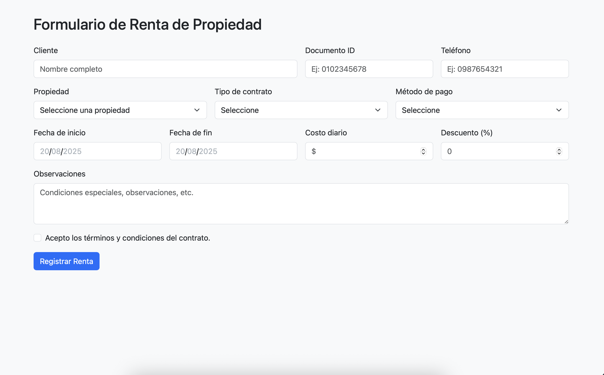
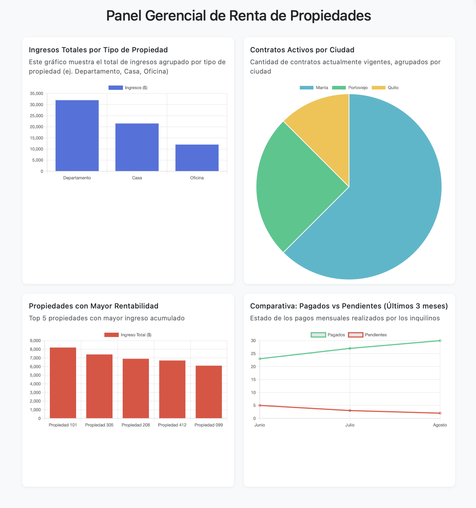

# Recu-bd-2025-1v2
# Examen Final de Recuperación - Base de Datos 3B SOFTWARE

Este repositorio contiene el enunciado visual del examen final de recuperación. A partir de las capturas de pantalla presentadas (`rent.png` y `dashboard.png`), los estudiantes deberán diseñar e implementar completamente una base de datos relacional que soporte todas las funcionalidades presentadas en el sistema.

---

## 🖼️ Interfaz Proporcionada


*Formulario visual para registrar una renta de vehículo*


*Visualización de reportes clave para la gestión del sistema*

---

## 🎯 Objetivo General

A partir de las imágenes proporcionadas, el estudiante deberá aplicar todos los conocimientos adquiridos durante el semestre para:

- **Modelar correctamente una base de datos**
- **Implementar lógica de negocio mediante procedimientos almacenados**
- **Aplicar seguridad mediante usuarios y permisos**
- **Crear reportes utilizando consultas complejas y vistas**
- **Interpretar visualizaciones y formular consultas a partir de los datos graficados**

---

## 📋 Actividades a realizar

1. **Modelo Relacional**
   - Definir al menos 5 entidades basadas en los formularios y reportes visuales.
   - Incluir: nombre de atributos, tipos de datos, llaves primarias/foráneas, restricciones (NOT NULL, UNIQUE, CHECK), relaciones (1:N, N:M si aplica).
   - Justificar las decisiones tomadas en el modelado.

2. **Procedimientos Almacenados**
   - Implementar el CRUD completo de al menos 2 entidades usando `CREATE PROCEDURE`.
   - Cada procedimiento deberá:
     - Recibir parámetros.
     - Validar existencia (para `INSERT`, `UPDATE`).
     - Validar dependencias (para `DELETE`).
     - Retornar mensajes o estados (RAISE NOTICE / RETURNS).

3. **Generación de Datos**
   - Insertar mínimo **800 registros** usando `generate_series()` u otras funciones (`random()`, `md5()`, etc.).
   - Automatizar la carga mediante ciclos `FOR`, `LOOP`, etc.

4. **Reportes SQL**
   - Implementar al menos 4 consultas SQL que generen los resultados necesarios para los gráficos del dashboard:
     - Rango de ingresos por tipo de vehículo
     - Estado de pagos por mes
     - Clientes con más rentas
     - Vehículos más utilizados
   - Las consultas deben incluir:
     - Joins complejos
     - Agregaciones
     - Agrupaciones por fecha
     - Subconsultas y `CASE WHEN` si es necesario

5. **Vistas**
   - Crear mínimo 2 vistas:
     - Una vista operativa de rentas activas con detalles clave
     - Una vista de gestión para reportes financieros mensuales

6. **Seguridad**
   - Crear al menos 2 usuarios:
     - Usuario de **reportes**: solo lectura sobre vistas y consultas analíticas.
     - Usuario de **operaciones**: permisos de inserción, modificación y eliminación solo a través de procedimientos almacenados.
   - Usar `GRANT`, `REVOKE`, `ALTER DEFAULT PRIVILEGES`.

---

## 📦 Entregable

- Script SQL completo con:
  - Creación de tablas y restricciones
  - Procedimientos almacenados
  - Inserts de prueba
  - Consultas y vistas
  - Configuración de usuarios y permisos
- Archivo PDF explicativo o archivo `README` dentro del proyecto con:
  - Diagrama ER
  - Justificación del modelado
  - Explicación de vistas y consultas clave

---

## 🧠 Evaluación

Este examen tiene el mismo enfoque de evaluación que el anterior. Además de cumplir con todos los requerimientos técnicos, se evaluará especialmente:

- **Capacidad de razonamiento** e interpretación de formularios
- **Justificación de decisiones de diseño**
- **Dominio de SQL intermedio-avanzado**
- **Autonomía en la resolución del problema**

### ⚠️ Advertencia

No se aceptarán trabajos que presenten estructuras idénticas entre compañeros. Cada estudiante debe **modelar, justificar y ejecutar su solución individualmente**. Cualquier copia parcial o total será considerada plagio.

---

## ✅ Evaluación según rúbrica (100%)

| Criterio                           | Peso |
|------------------------------------|------|
| Modelo Relacional                  | 15%  |
| Procedimientos Almacenados (CRUD)  | 20%  |
| Generación de Datos Aleatorios     | 10%  |
| Consultas SQL y Reportes           | 20%  |
| Vistas                             | 15%  |
| Seguridad y Permisos               | 10%  |
| Documentación y Organización       | 10%  |

---

## 🛠️ ¿Cómo trabajar el examen?

Puedes clonar este repositorio para tener acceso a las imágenes:

```bash
git clone https://github.com/usuario/repositorio-examen-recuperacion.git
cd repositorio-examen-recuperacion